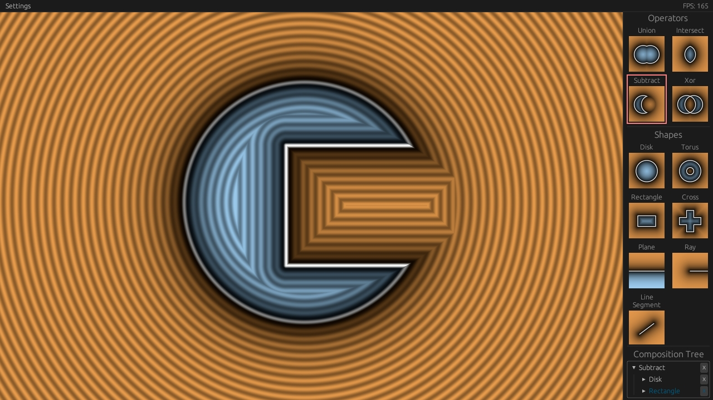

# SDF Builder


Build a 2D signed distance field by composing primitives with boolean operators 

Uses
[rust-gpu](https://github.com/Rust-GPU/rust-gpu),
[wgpu](https://github.com/gfx-rs/wgpu), and
[egui](https://github.com/emilk/egui)

## Usage

```bash
nix run github:abel465/sdf-builder
```

## Development
Shader hot reloading is enabled
```bash
git clone https://github.com/abel465/sdf-builder.git
cd rust-gpu-shaders
nix develop
cargo run --release
```
